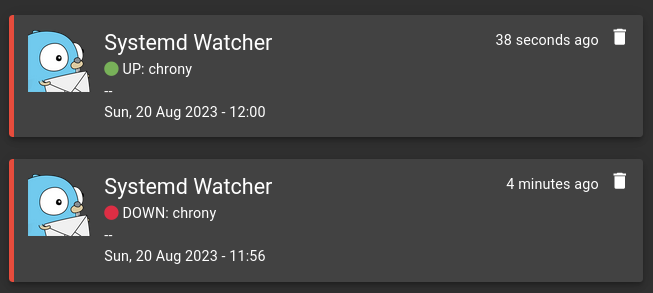

# systemd-watcher

- Watch health of services defined in SERVICE_LIST 
- Send notifications for every changing state (up -> down / down -> up)
  - Over Gotify
  - Maybe more in the future

## Install

```
git clone https://gitlab.com/snax44/systemd-watcher.git
cd systemd-watcher
cp systemd-watcher /usr/local/bin/
chmod 750 /usr/local/bin/systemd-watcher
cp systemd-watcher.service /lib/systemd/system/ 
systemctl daemon-reload
systemctl enable --now systemd-watcher
cd .. && rm -rf systemd-watcher
```

Do not forget to modify the variables at the beginning of the script `/usr/local/bin/systemd-watcher`

## Get the logs

```bash
journalctl -u systemd-watcher
```

## ScreenShot



# Todo:

- Make the script retrying to send the alert in case the previous attempt failed and service is still in the same state.   
